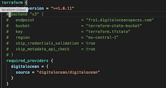

# Bootstrap Terraform IaC on Digital Ocean

Based on [this Medium post](https://medium.com/swlh/lets-do-devops-bootstrap-aws-to-your-terraform-ci-cd-azure-devops-github-actions-etc-b3cc5a636dce) and [this repo](https://github.com/MattMorgis/digitalocean-spaces-terraform-backend).

## Prerequisites
- A Digital Ocean account
- Terraform version 1.0.11
## How to use

1. Clone this repository. (Change bucket region if necessary, both in the variables and backend section.)
2. Export the needed environment variables:
```
export TF_VAR_do_token=<YOUR_DO_PERSONAL_ACCESS_TOKEN>
export TF_VAR_spaces_access_key_id=<YOUR_DO_SPACES_ACCESS_KEY_ID>
export TF_VAR_spaces_secret_key=<YOUR_DO_SPACES_SECRET_KEY>
export AWS_ACCESS_KEY_ID=<YOUR_DO_SPACES_ACCESS_KEY_ID>
export AWS_SECRET_KEY=<YOUR_DO_SPACES_SECRET_KEY>
```
3. comment out the `backend` block in the `terraform block



4. Run `terraform init`. The statefile will be generated locally
5. Run `terraform plan`. You should see that an DO S3 bucket will be created
6. Run `terraform apply` to create the S3 bucket
7. Add the previously-commented-out backend section again.
8. Run `terraform init` again. You will be prompted to ask if you want to copy the local state to the remote bucket. Pick `yes`.
9. Run `terraform plan`. Your plan should come up empty.
10. Rejoice, you have bootstrapped a terraform with a remote state hosted on Digital Ocean.